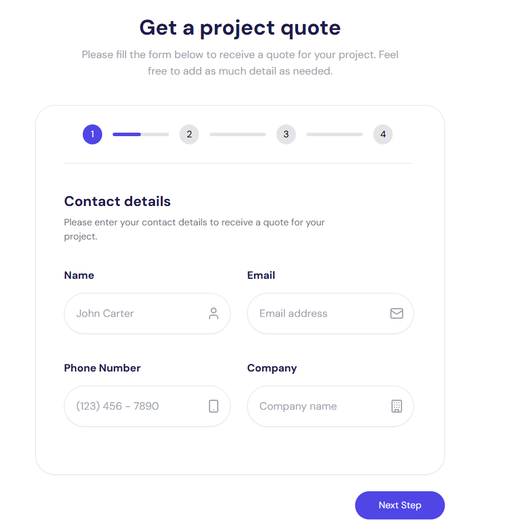

# Multi-step Form

## Table of contents

- [Overview](#overview)
  - [Screenshot](#screenshot)
  - [Built with](#built-with)
  - [Features](#features)
  - [Links](#links)
- [Acknowledgments](#acknowledgments)

## Overview

### Screenshot

### Built with

- 🌐 **Next.js 14** - The React framework for production
- 🎨 **TailwindCSS** - Utility-first CSS framework for rapid UI development
- ⚛️ **React Hook Form** - Performant, flexible and extensible forms with easy-to-use validation
- 📜 **Zod** - TypeScript-first schema declaration and validation

### Features

- 📋 Multi-step form with validation
- 🔄 Smooth animations between steps

### Links

## Acknowledgments

A special thanks to all the open-source contributors and the creators of the libraries and tools used in this project.
